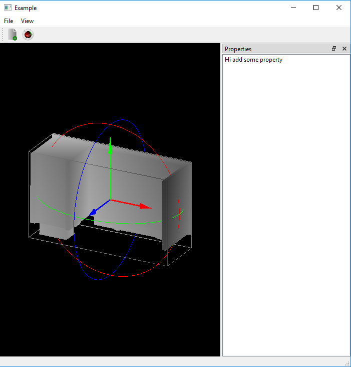

# 09_trackBall

TrackBall to rotate the objects:
  1) TrackBall rotation here means rotating the object with mouse
  2) TrackBall class is implemented
      a) It take position of mouse when a button is pressed and store as last mouse position
      b) If the mouse is moved while button is pressed, store those point as current position
      c) Project these point on unit sphere (please see reference for further theory)
      d) Find axis of rotation from last point to current point using cross product
      e) Calculate angle of rotation from the axis of rotation
      f) Axis-Angle rotation matrix is used to represent current rotation
  3) Additional things:
      a) TrackBallSphere class that show a mesh to represent three circle
      b) Frame class use arrow.ply to represent frame to objects
  
  
Output Image:

Reference:
https://www.khronos.org/opengl/wiki/Object_Mouse_Trackball

